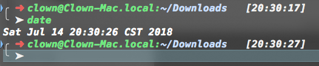

oh-my-zsh::theme::seeker
========================

This is my favored oh-my-zsh theme which forked by the official theme
`robbyrussell` and `gnzh`.

This theme uses many special unicode characters to be fancy, but it may cause
some problems without well supported fonts. If you hope to find a theme more
simple (such as using ascii-only prompt in a remote server), I recommend
the [ys][].

Installation
------------

1. copy `seeker.zsh-theme` to ~/.oh-my-zsh/custom/themes/
2. then change .zshrc ZSH_THEME to "seeker"

Screenshot
==========

[ys]: https://github.com/robbyrussell/oh-my-zsh/wiki/Themes#ys
[antigen]: https://github.com/zsh-users/antigen
